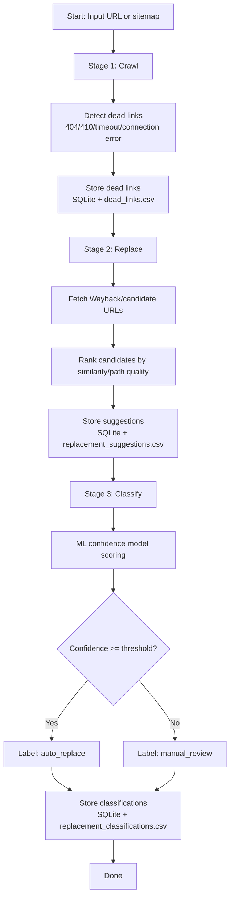

```mermaid
flowchart TD
    A[Start: Input URL or sitemap] --> B[Stage 1: Crawl]
    B --> C[Detect dead links<br/>404/410/timeout/connection error]
    C --> D[Store dead links<br/>SQLite + dead_links.csv]

    D --> E[Stage 2: Replace]
    E --> F[Fetch Wayback/candidate URLs]
    F --> G[Rank candidates by similarity/path quality]
    G --> H[Store suggestions<br/>SQLite + replacement_suggestions.csv]

    H --> I[Stage 3: Classify]
    I --> J[ML confidence model scoring]
    J --> K{Confidence >= threshold?}
    K -->|Yes| L[Label: auto_replace]
    K -->|No| M[Label: manual_review]
    L --> N[Store classifications<br/>SQLite + replacement_classifications.csv]
    M --> N

    N --> T[Done]
```
